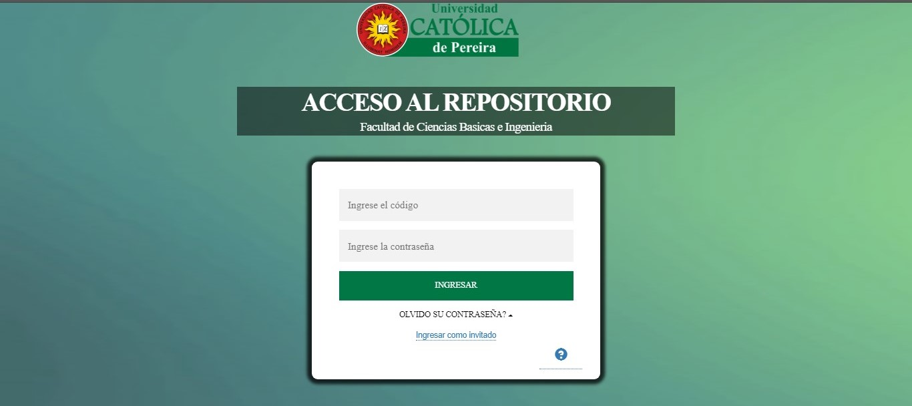
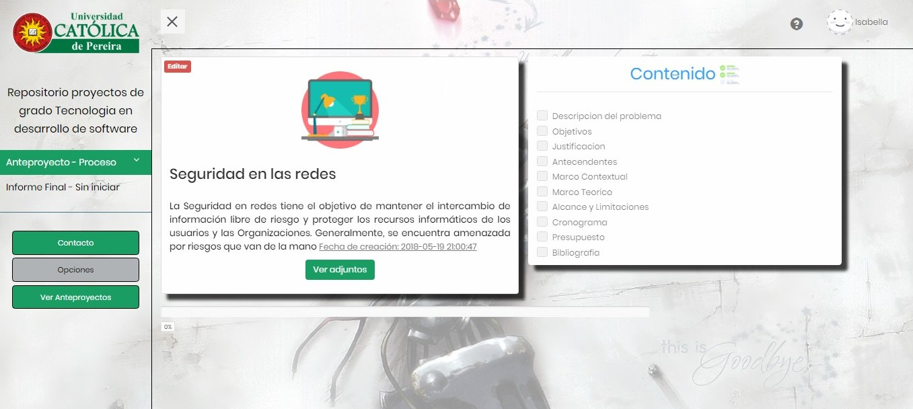
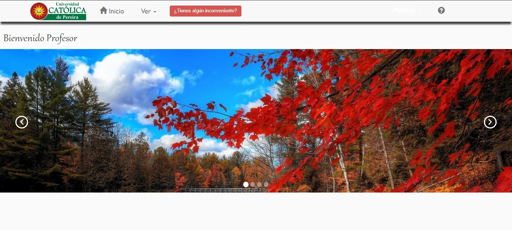

# Informacion del repositorio

Es una plataforma web de  almacenamiento y seguimiento de los proyectos 
de grado e informes finales.

# Preview
## Pagina de logeo

## Modulo de estudiante

## Modulo del profesor

## Modulo administrador

# Tecnología para el desarrollo
- HTML
- Css
- Javascript
- PHP
    - Codeignither
- Mysql
- Libs
    - Jquery
    - Boostrap
    - AnimateCss
